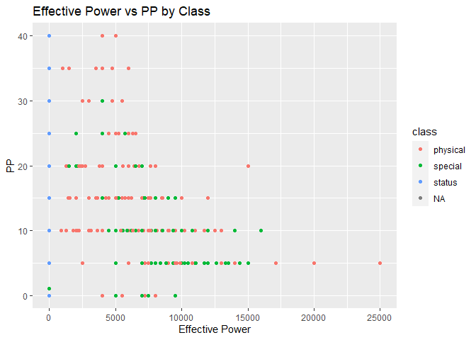
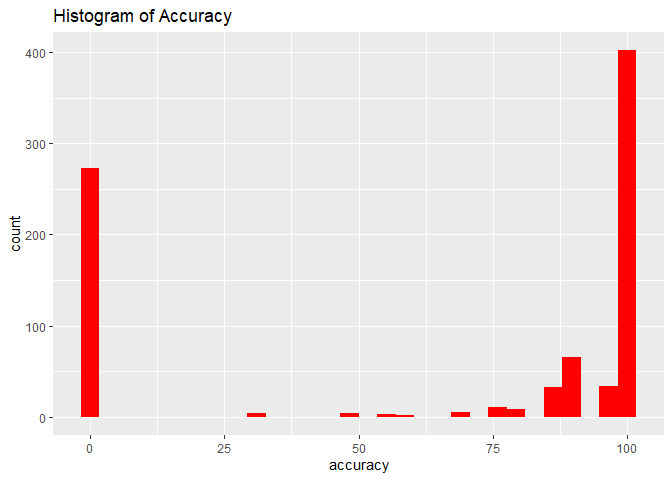
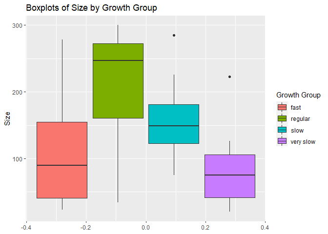
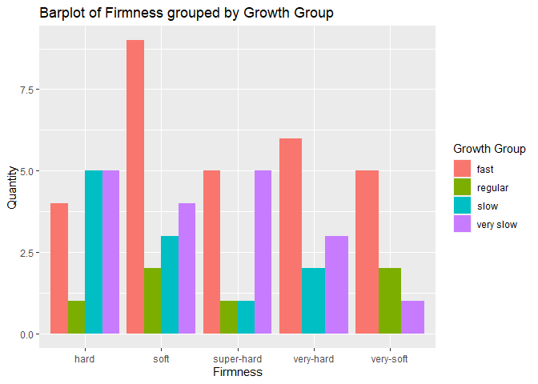
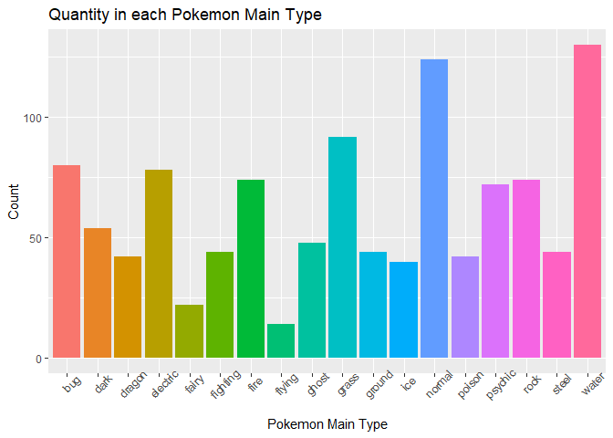
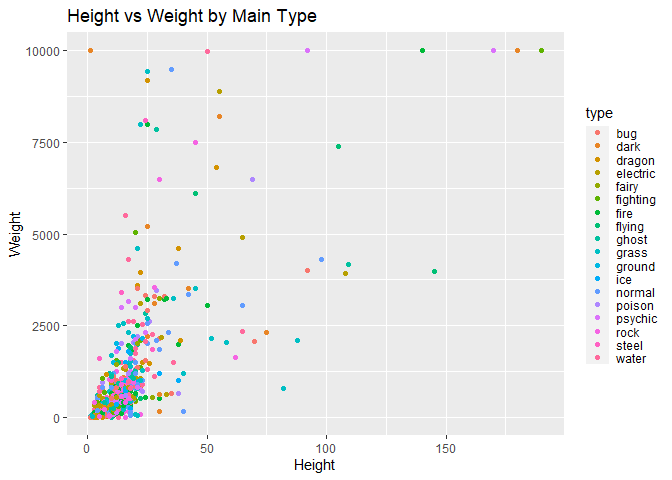

Pokemon API
================
Ryan Bunn

This page is a vignette showing the retrevial of data from the Pokemon API found at \[<https://pokeapi.co/>\]. The API accessing functions are designed to hopefully be able to return general data that can be used as additional arguements to the function to return more specific data.

# Required Packages

For obtaining information from the Pokemon API and the subsequent data analysis the following packages were used

`tidyverse` `httr` `jsonlite` `ggplot2`

    ## -- Attaching packages --------------------------------------------------------------------------------------------------------- tidyverse 1.3.1 --

    ## v ggplot2 3.3.5     v purrr   0.3.4
    ## v tibble  3.1.4     v dplyr   1.0.7
    ## v tidyr   1.1.3     v stringr 1.4.0
    ## v readr   2.0.1     v forcats 0.5.1

    ## -- Conflicts ------------------------------------------------------------------------------------------------------------ tidyverse_conflicts() --
    ## x dplyr::filter() masks stats::filter()
    ## x dplyr::lag()    masks stats::lag()

    ## 
    ## Attaching package: 'jsonlite'

    ## The following object is masked from 'package:purrr':
    ## 
    ##     flatten

# API Functions

## Results Dataframe

As the API functions are designed to be used on a single variable input these functions can take in the results from a `lapply` of the API accessing functions and turn them into a nice dataframe.

``` r
  #Returns numerics as a nicer dataframe
  ResultsToDataframe<- function(object){
    object<-as.numeric(as.character(object))
    object<-unlist(object)
    object<-as.data.frame(object)
    object[sapply(object, is.na)] = 0
    return(object)
  }
  #returns a deeper level item
  depth2<- function(value){
    value <-unlist(value)
    value <-value[c(TRUE,FALSE)]
    return(value)
  }
  #removes null values and replaces them with NA as unlist() deletes null values
  removeNull <- function(x, func=function(x) if(is.null(x)) NA else x){
      if(is.list(x)){
      lapply(x, removeNull, func)
    } else{
        func(x)
    }
}
```

## Berries

This function is designed to extract information on berries, the `type` variable allows for information to be extracted based upon berry type, firmness, or flavor. In addition the `specific` variable when not specificed extracts data on the different subvariables. When `specific` is specified, as one of the subvariables, more detailed information can be extracted. In addition, the `val` variable allows for highly detailed information to be extracted about a particular berry. Finally the limit variable allows us to limit the number of results as needed.

``` r
#Primary function for finding berry information
berry <- function(type,specific="",val="",limit=100){
  limit = as.character(limit)
  if(!is_character(type)){
    stop("Error: Must be string")
  }
  base <- "https://pokeapi.co/api/v2"
  #Queries the API based upon berry endpoint
  if(type=="berry"){
    hyperlink <- paste0(base,"/berry/",specific,"/?limit=",limit)
    a<-GET(hyperlink)
    data <- fromJSON(rawToChar(a$content))
    if(val!=""){return(data[[val]])}
    if(specific != ""){
    return(data)}
    else{
      return(data$results)}
  }
  #Queries the API based upon firmness endpoint
    else if (type=="firmness"){
      hyperlink <- paste0(base,"/berry-firmness/",specific,"/?limit=",limit)
      a<-GET(hyperlink)
      data <- fromJSON(rawToChar(a$content))
      if(specific != ""){
    return(data$berries)}
    else{
      return(data$results)}
    }
  #Queries the API based upon flavor endpoint
      else if(type=="flavor"){
        hyperlink <- paste0(base,"/berry-flavor/",specific,"/?limit=",limit)
        a<-GET(hyperlink)
        data <- fromJSON(rawToChar(a$content))
        if(specific != ""){
    return(data$berries)}
    else{
      return(data$results)}
      }
        #Catches and issues
        else{
          stop("Error: Must be one of berry,firmness,flavor")
        }
}
```

## Moves

This function is designed to extract information on moves, the `type` variable allows for information to be extracted based upon move, category, or class. In addition the `specific` variable when not specificed extracts data on the different subvariables. When `specific` is specified, as one of the subvariables, more detailed information can be extracted. The `val` variable allows for highly detailed information to be extracted about a particular move. Finally the limit variable allows us to limit the number of results as needed.

``` r
#Primary function for finding move information
move <- function(type,specific="",val="",val2="",limit=1000){
  if(!is_character(type) || !is_character(val)){
    stop("Error: Must be string")
  }
  #Queries the API based upon move endpoint
  if(type == "move"){
  base <- "https://pokeapi.co/api/v2/move/"
  link<-paste0(base,specific,"/?limit=",limit)
  a<- GET(link)
  r<- fromJSON((rawToChar(a$content)))
  if(val != ""){return(unlist(r[[val]]))}
  if(specific != ""){return(r)}
  return(r$results)
  #Queries the API based upon move category endpoint
  }else if(type == "category"){
      base <- "https://pokeapi.co/api/v2/move-category/"
      link<-paste0(base,specific,"/?limit=",limit)
      a<- GET(link)
      r<- fromJSON((rawToChar(a$content)))
      if(specific != "") return(r$moves)
      else{return(r$results)}
    #Queries the API based upon damage class endpoint
  } else  if(type == "class"){
    base <- "https://pokeapi.co/api/v2/move-damage-class/"
    link<-paste0(base,specific,"/?limit=",limit)
    a<- GET(link)
    r<- fromJSON((rawToChar(a$content)))
    if(specific != ""){
      if(val != ""){return(r[[val]])}
      return(r$moves)}
    else{return(r$results)}
  } else {
    #catches any issues
    stop("Error: Must be one of move,category,class")
  }
}
```

## Pokemon

This function is designed to extract information on pokemon, the `type` variable allows for information to be extracted based upon ability, pokemon, or stat of interest. In addition the `specific` variable when not specificed extracts data on the different subvariables. When `specific` is specified, as one of the subvariables, more detailed information can be extracted.The `val` variable allows for highly detailed information to be extracted about a particular pokemon. `val2` and `val3` are used with the pokemon endpoint to travel deeper into the provided data. In addition, the `inc` variable allows the user to specify if they would like the stats results to be in increasing order. Finally the limit variable allows us to limit the number of results as needed.

``` r
#Primary function for finding pokemon information
  pokemon <- function(type,specific="",val="",val2="",val3="",inc=TRUE,limit=1000){
    if(!is_character(type)){
      stop("Error: Must be string")
    } 
    #Queries the API based upon ability endpoint
    if(type=="ability"){
      base <- "https://pokeapi.co/api/v2/ability/"
      link <- paste0(base,specific,"/?limit=",limit)
      a <- GET(link)
      r<- fromJSON(rawToChar(a$content))
      if(specific != ""){return(r$pokemon)}
      return(r)
    }
    #Queries the API based upon pokemon endpoint
    if(type == "pokemon"){
      base <- "https://pokeapi.co/api/v2/pokemon/"
      link <- paste0(base,specific,"/?limit=",limit)
      a <- GET(link)
      r<- fromJSON(rawToChar(a$content))
      if(val !=""){
        if(val2 != ""){
          if(val3 !=""){return(r[[val]][[val2]][[val3]])}
          
          return(r[[val]][val2])}
        return(r[[val]])}
      if(specific!= ""){return(r$weight)}
      else {return(r$results)}
    }
    #Queries the API based upon stats endpoint
    if(type == "stats"){
      base <- "https://pokeapi.co/api/v2/stat/"
      link <- paste0(base,specific,"/?limit=",limit)
      a <- GET(link)
      r<- fromJSON(rawToChar(a$content))
      if(specific!=""){
        if(inc){return(r$affecting_moves$increase)}
        else{return(r$affecting_moves$decrease)}
      }
      else{return(r$results)}
    }
  }
```

## Wrapper

This wrapper function is designed so that only a single function needs to be called with the function of interest and any other inputs specified.

``` r
#Wrapper function that makes accessing more general
  API_Wrapper <- function(fun,...){
    if(!is_character(fun)){
    stop("Error: Must be string for function")
  }
    if(fun=="berry"){
      berry(...)
    }
      else if(fun=="move"){
        move(...)
      }
        else if(fun=="pokemon"){
          pokemon(...)
        }
    #catches any issues
          else{
            stop("Error: fun must be one of berry, move, pokemon")}
  }
```

# Exploratory Data Analysis

## Moves

We are interested in specifics about the various moves in the pokemon game. We start by collecting a list of the first 250 moves and then determining the accuracy, power, pp, and damage class.

``` r
all_moves<-API_Wrapper("move",type="move",limit=1000)[,1]

accuracy<-sapply(X=all_moves,API_Wrapper,fun="move",type="move",val="accuracy")
accuracy <- ResultsToDataframe(accuracy)

power <- sapply(X=all_moves,API_Wrapper,fun="move",type="move",val="power")
power <- ResultsToDataframe(power)

pp <- sapply(X=all_moves,API_Wrapper,fun="move",type="move",val="pp")
pp<-ResultsToDataframe(pp)

class <- sapply(X=all_moves, API_Wrapper,fun="move",type="move",val="damage_class")
class <- removeNull(class)
class <- sapply(class,`[`,"name")
class <- as.data.frame(class)

data<- cbind(accuracy,power,pp,class)
colnames(data)<- c("accuracy","power","pp","class")
```

Next we can create some a variable that gives us an insight into the effective power of a move by accounting for limitations in power, accuracy and/or number of available uses. It may be benificial to see how many of our responses fall into particular categories for class Finally we can also look at some numerical summarises of the variables based upon the class of the move.

``` r
data <- data %>% mutate(effectivePower = power*accuracy)

table(data$class)
```

    ## 
    ## physical  special   status 
    ##      330      235      261

``` r
data %>% group_by(class) %>% summarise(avg_power = mean(power), sd_power=sd(power),avg_accuracy=mean(accuracy),sd_accuracy=sd(accuracy),avg_pp=mean(pp),sd_pp=sd(pp))
```

    ## # A tibble: 4 x 7
    ##   class    avg_power sd_power avg_accuracy sd_accuracy avg_pp sd_pp
    ##   <chr>        <dbl>    <dbl>        <dbl>       <dbl>  <dbl> <dbl>
    ## 1 physical      66.9     44.8         84.8        31.5   13.5  8.57
    ## 2 special       75.3     46.2         81.7        35.3   10.5  7.09
    ## 3 status         0        0           28.0        43.5   16.5  9.51
    ## 4 <NA>           0        0            0           0      0    0

Observing the output contingency table we see that there are more physical moves than special and status moves, it may be interesting to see how the moves further breakdown in future analysis. The numerical summaries show us an NA section for class which may mean the API is missing data or there is a undefined class of moves. It may be beneficial to investigate the reason for the NA later.

We can then make some comparisons between the effective power and the number of times an ability can be used for each class by looking at a scatter plot

``` r
  g<-ggplot(data,aes(effectivePower,pp))
  g+geom_point(aes(color=class))+labs(x="Effective Power",y="PP",title = "Effective Power vs PP by Class")
```



Observing the scatterplot we see that a high effective power seems to guarantee a low PP value, but a low PP value does not guarentee a high effective power. We also see that the status class sticks to the 0 effective power, which mirrors the results seen summary table before.

Next we can look at the distribution of accuracy across moves

``` r
  h<- ggplot(data,aes(accuracy))
  h+geom_histogram(fill="red")+labs(title="Histogram of Accuracy")
```

    ## `stat_bin()` using `bins = 30`. Pick better value with `binwidth`.



Our histogram tells us that the most moves generally fall under 0 accuracy(accuracy irrelevent) or 100 accuracy and very few elements have an accuracy in between. It may be interesting to see in future analysis how the type and/or effective power factor into accuracy values.

# Berries

Next we are interested in looking at the aspects that berrys in the pokemon games have like their size, growth speed, harvest quantity, firmness type, and flavor.

``` r
berries <- API_Wrapper("berry",type="berry",limit=1000)[,1]
size <- sapply(X=berries, API_Wrapper,fun="berry",type="berry",val="size")
size<-ResultsToDataframe(size)

growth <- sapply(X=berries, API_Wrapper,fun="berry",type="berry",val="growth_time")
growth<-ResultsToDataframe(growth)

harvest <- sapply(X=berries, API_Wrapper,fun="berry",type="berry",val="max_harvest")
harvest<-ResultsToDataframe(harvest)

firm <- sapply(X=berries,API_Wrapper,fun="berry",type="berry",val="firmness")
firm<-depth2(firm)

gift <- sapply(X=berries,API_Wrapper,fun="berry",type="berry",val="natural_gift_type")
gift <- depth2(gift)

data2 <- cbind(size,growth,harvest,firm,gift)
colnames(data2) <- c("size","growth","harvest","firmness","natural_gift")
```

We can then create 2 new variables to put growth time into class and then a variable for the number harvested for growth time unit. Next we look at parrallel boxplots of the size based upon the new growth time class.

``` r
data2 <- data2 %>% mutate(g_class=if_else(growth >15,"fast",if_else(growth >10,"regular",if_else(growth > 5,"slow","very slow"))),"effeciency"=harvest/growth)

i<-ggplot(data2,aes(size, group=g_class))
i+geom_boxplot(aes(fill=g_class))+coord_flip()+labs(x="Size",title = "Boxplots of Size by Growth Group")+scale_fill_discrete(name="Growth Group")
```



Observing our parrallel boxplots we see that the average growth speed has the largest size with the very slow speed have a much smaller size. We also see that the fast speed have a small size similar. It may be interesting to see if there is a significant difference statistically between any of the groups.

Then we can create a barplot with information on firmness counts subdivided by growth class

``` r
j<- ggplot(data2,aes(firmness))
j+geom_bar(aes(fill=g_class),position = "dodge")+labs(x="Firmness",y="Quantity",title="Barplot of Firmness grouped by Growth Group")+scale_fill_discrete(name="Growth Group")
```



The bar graph does not seem to reveal any replationship between the firmness of the berries and the growth group to which the berry belongs.

Next we can look at some contingency tables of our data, to make things interesting we can create 2 way and even 3 way contingency tables. Then we can look at some numerical sumarise of the numeric variables when grouped by each of the categorical variables individually.

``` r
data2 %>% select(natural_gift,firmness) %>% table()
```

    ##             firmness
    ## natural_gift hard soft super-hard very-hard very-soft
    ##     bug         2    1          0         0         1
    ##     dark        0    2          1         0         1
    ##     dragon      0    2          2         0         0
    ##     electric    0    0          1         0         3
    ##     fighting    1    1          0         2         0
    ##     fire        0    3          1         0         0
    ##     flying      0    2          1         1         0
    ##     ghost       2    1          1         0         0
    ##     grass       2    1          0         1         0
    ##     ground      3    1          0         0         0
    ##     ice         0    0          1         3         0
    ##     normal      0    0          0         0         1
    ##     poison      2    0          1         1         0
    ##     psychic     0    2          1         1         0
    ##     rock        2    1          0         0         1
    ##     steel       0    0          1         1         1
    ##     water       1    1          1         1         0

``` r
data2 %>% select(natural_gift,firmness,g_class) %>% table()
```

    ## , , g_class = fast
    ## 
    ##             firmness
    ## natural_gift hard soft super-hard very-hard very-soft
    ##     bug         1    0          0         0         1
    ##     dark        0    0          1         0         1
    ##     dragon      0    2          0         0         0
    ##     electric    0    0          0         0         1
    ##     fighting    0    1          0         1         0
    ##     fire        0    0          1         0         0
    ##     flying      0    1          0         1         0
    ##     ghost       1    0          1         0         0
    ##     grass       0    1          0         1         0
    ##     ground      1    1          0         0         0
    ##     ice         0    0          0         2         0
    ##     normal      0    0          0         0         1
    ##     poison      1    0          0         1         0
    ##     psychic     0    1          1         0         0
    ##     rock        0    1          0         0         1
    ##     steel       0    0          1         0         0
    ##     water       0    1          0         0         0
    ## 
    ## , , g_class = regular
    ## 
    ##             firmness
    ## natural_gift hard soft super-hard very-hard very-soft
    ##     bug         0    0          0         0         0
    ##     dark        0    1          0         0         0
    ##     dragon      0    0          0         0         0
    ##     electric    0    0          0         0         1
    ##     fighting    0    0          0         0         0
    ##     fire        0    1          0         0         0
    ##     flying      0    0          1         0         0
    ##     ghost       0    0          0         0         0
    ##     grass       0    0          0         0         0
    ##     ground      0    0          0         0         0
    ##     ice         0    0          0         0         0
    ##     normal      0    0          0         0         0
    ##     poison      0    0          0         0         0
    ##     psychic     0    0          0         0         0
    ##     rock        0    0          0         0         0
    ##     steel       0    0          0         0         1
    ##     water       1    0          0         0         0
    ## 
    ## , , g_class = slow
    ## 
    ##             firmness
    ## natural_gift hard soft super-hard very-hard very-soft
    ##     bug         1    0          0         0         0
    ##     dark        0    0          0         0         0
    ##     dragon      0    0          1         0         0
    ##     electric    0    0          0         0         0
    ##     fighting    1    0          0         0         0
    ##     fire        0    0          0         0         0
    ##     flying      0    1          0         0         0
    ##     ghost       0    1          0         0         0
    ##     grass       0    0          0         0         0
    ##     ground      1    0          0         0         0
    ##     ice         0    0          0         1         0
    ##     normal      0    0          0         0         0
    ##     poison      1    0          0         0         0
    ##     psychic     0    1          0         1         0
    ##     rock        1    0          0         0         0
    ##     steel       0    0          0         0         0
    ##     water       0    0          0         0         0
    ## 
    ## , , g_class = very slow
    ## 
    ##             firmness
    ## natural_gift hard soft super-hard very-hard very-soft
    ##     bug         0    1          0         0         0
    ##     dark        0    1          0         0         0
    ##     dragon      0    0          1         0         0
    ##     electric    0    0          1         0         1
    ##     fighting    0    0          0         1         0
    ##     fire        0    2          0         0         0
    ##     flying      0    0          0         0         0
    ##     ghost       1    0          0         0         0
    ##     grass       2    0          0         0         0
    ##     ground      1    0          0         0         0
    ##     ice         0    0          1         0         0
    ##     normal      0    0          0         0         0
    ##     poison      0    0          1         0         0
    ##     psychic     0    0          0         0         0
    ##     rock        1    0          0         0         0
    ##     steel       0    0          0         1         0
    ##     water       0    0          1         1         0

``` r
data2 %>% group_by(firmness) %>% summarise(avg_growth=mean(growth),avg_size=mean(size),avg_harvest=mean(harvest))
```

    ## # A tibble: 5 x 4
    ##   firmness   avg_growth avg_size avg_harvest
    ##   <chr>           <dbl>    <dbl>       <dbl>
    ## 1 hard             10.3     119.        6.67
    ## 2 soft             13.7     120.        6.67
    ## 3 super-hard       11.4     120.        5.83
    ## 4 very-hard        14.2     122.        5.91
    ## 5 very-soft        16.1     124.        7.5

``` r
data2 %>% group_by(g_class) %>% summarise(avg_size=mean(size),avg_harvest=mean(harvest))#g_class based upon growth
```

    ## # A tibble: 4 x 3
    ##   g_class   avg_size avg_harvest
    ##   <chr>        <dbl>       <dbl>
    ## 1 fast         115.         5   
    ## 2 regular      207.        13.3 
    ## 3 slow         157          6.82
    ## 4 very slow     78.8        6.39

``` r
data2 %>% group_by(natural_gift) %>% summarise(avg_growth=mean(growth),avg_size=mean(size),avg_harvest=mean(harvest))
```

    ## # A tibble: 17 x 4
    ##    natural_gift avg_growth avg_size avg_harvest
    ##    <chr>             <dbl>    <dbl>       <dbl>
    ##  1 bug                13.2     93          6.25
    ##  2 dark               15.5    112.         7.5 
    ##  3 dragon             13.2    101.         6.25
    ##  4 electric            9.5    166          8.75
    ##  5 fighting           13.5     87.5        5   
    ##  6 fire                9.5    117          8.75
    ##  7 flying             15.5    140.         5   
    ##  8 ghost              13.2    191.         6.25
    ##  9 grass              11.8     94.8        6.25
    ## 10 ground             13.5     81.5        5   
    ## 11 ice                13.2     88.2        5   
    ## 12 normal             18       34          5   
    ## 13 poison             13.5    118          5   
    ## 14 psychic            14.5    175          5   
    ## 15 rock               13.2     81          6.25
    ## 16 steel              11.7    210.        10   
    ## 17 water               9.5    118.         8.75

The contingency tables don't show very much likely because the number of berries is small, but future games may include more berries and improve the results. The summary statistics for each of the 3 categorical variables seem interesting. It may be worth while to see if a growth class(or Growth) or firmness can be predicted using some of the numeric variables.

# Pokemon

Finally we may want to look at some data on the pokemon like the type, the height, and even the weight.

``` r
pokemons <- API_Wrapper("pokemon",type="pokemon",limit=10000)[,1]

type <- lapply(pokemons, API_Wrapper,fun="pokemon",type="pokemon",val="types",val2="type",val3="name")
type <- lapply(type, `[`,1)
type <- depth2(type)

height <- lapply(pokemons, API_Wrapper,fun="pokemon",type="pokemon",val="height")
height <- ResultsToDataframe(height)

weight <- lapply(pokemons, API_Wrapper,fun="pokemon",type="pokemon",val="weight")
weight <- ResultsToDataframe(weight)

data3 <- cbind(type,height,weight)
colnames(data3)<- c("type","height","weight")
```

We can even look at a barplot of the various types of pokemon.

``` r
k<-ggplot(data3,aes(type))
k+geom_bar(aes(fill=type))+theme(axis.text.x = element_text(angle=45))+labs(x="Pokemon Main Type",y="Count",title="Quantity in each Pokemon Main Type")+guides(fill="none")
```



Observing the barplot we see that water and normal are the developers favorite main pokemon types. This may or may not be due to pokemon in ocean locations have exclusively water main elements. It may be interesting to see if this is the reason for the large number of water type pokemon.

Finally we can create a scatterplot of height vs weight grouped by the pokemon type, we specifically exclude the pokemon with height values over 200 to get a better look at the data

``` r
data4 <- data3 %>% filter(height < 200)
l <- ggplot(data4,aes(height,weight))
l+geom_point(aes(color=type))+labs(title="Height vs Weight by Main Type",x="Height",y="Weight")+theme(legend.key.height = unit(.35, 'cm'))
```



Here we see the data is somewhat difficult to interpret so it may be beneficial to look at each type individually. It also may be interesting to see if a prediction can be made for height using type and weight.
